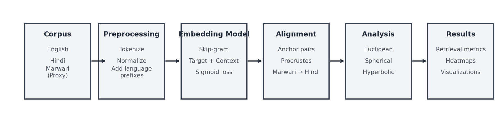
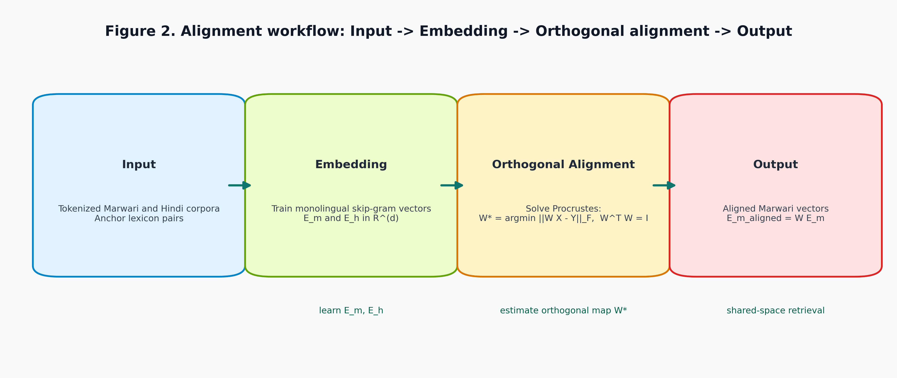
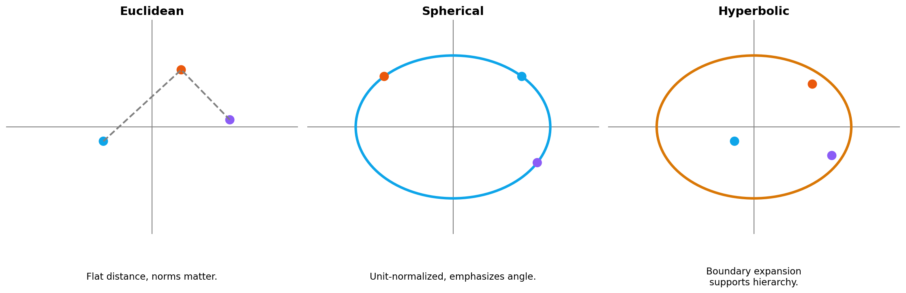
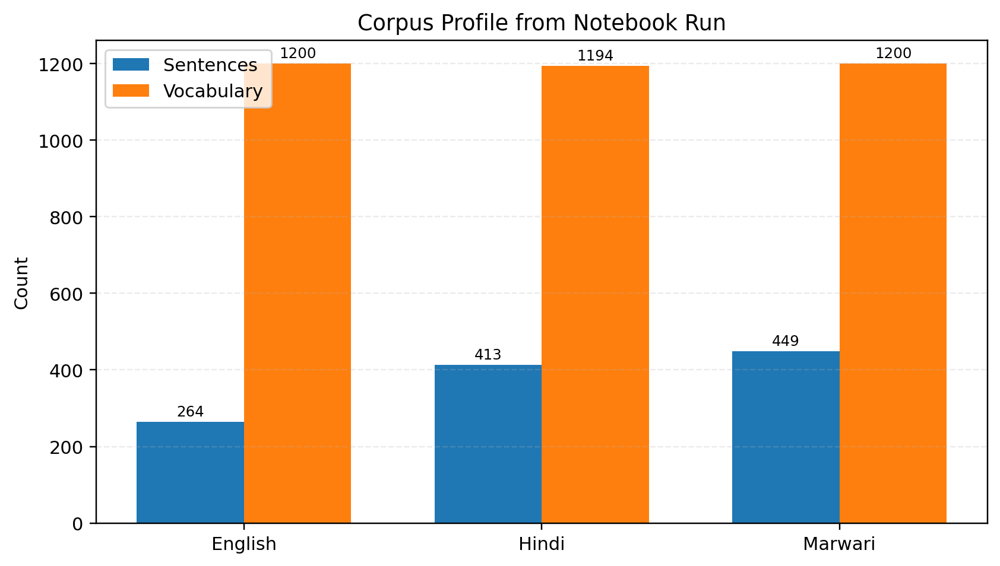
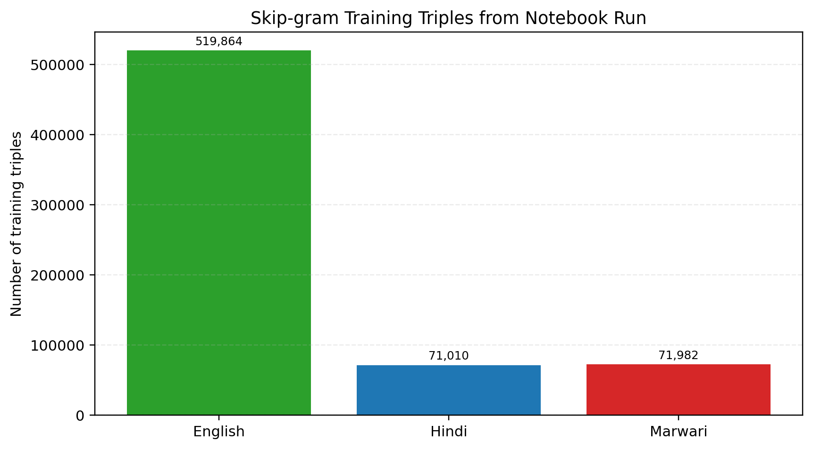
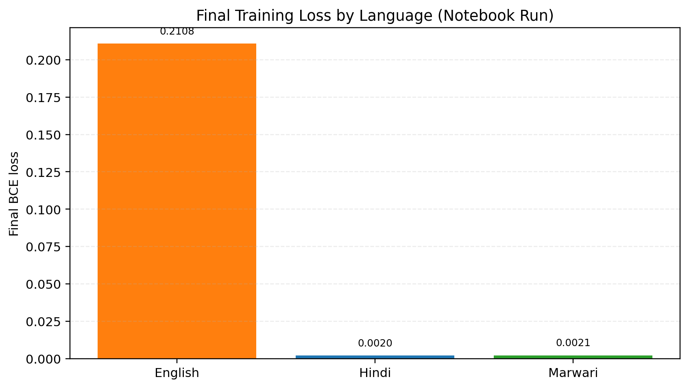
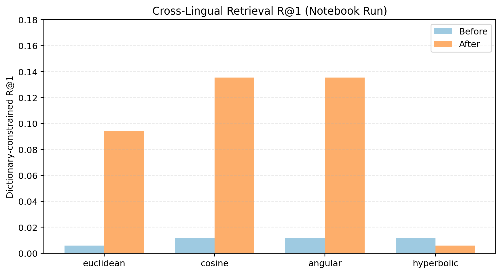
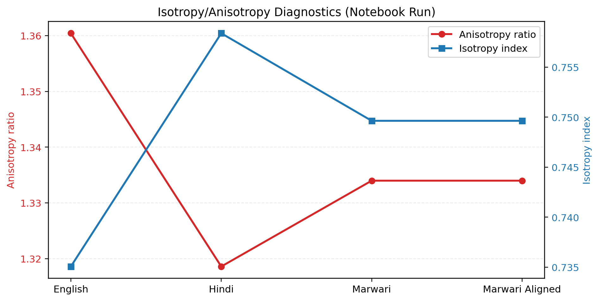

# Geometry of Embedding Spaces for Multilingual Low-Resource NLP: A Comparative Study of Marwari, Hindi, and English

**Authors:** Arnav Karwa, Prof. Suja Sreejith Panickar  
**Affiliation:** Department of Computer Engineering and Technology, School of Computer Science and Engineering, Dr. Vishwanath Karad MIT World Peace University, Pune, Maharashtra, India

## Keywords

Multilingual embeddings, low-resource NLP, Marwari language technology, cross-lingual alignment, hyperbolic geometry, anisotropy diagnostics.

## Abstract

Multilingual NLP systems remain uneven in quality because low-resource languages are typically represented by smaller and noisier corpora than high-resource counterparts. This paper investigates that disparity through a geometry-driven study of Marwari, Hindi, and English embedding spaces. The notebook workflow trains compact skip-gram-style embeddings, aligns Marwari to Hindi via orthogonal Procrustes mapping, and evaluates behavior under Euclidean, spherical, and hyperbolic views. The core contribution is methodological: a reproducible pipeline that unifies corpus diagnostics, metric-sensitive retrieval evaluation, and isotropy analysis. In the saved run, dictionary-constrained retrieval improves after alignment for Euclidean, cosine, and angular metrics, whereas hyperbolic retrieval changes are smaller and mixed, indicating that alignment gains are not metric invariant. Isotropy diagnostics further confirm that orthogonal mapping preserves intrinsic spectral shape, as expected for a rotation/reflection transform. Overall, the results show that geometric assumptions can materially alter cross-lingual interpretation and evaluation in low-resource multilingual settings.

## 1. Introduction

Natural language processing in multilingual environments still suffers from an uneven resource landscape. Languages such as English have large, curated corpora and mature tooling, while languages like Marwari often have fragmented, noisy, or domain-limited data. This imbalance creates a practical challenge: models trained with standard methods can produce weak embeddings for low-resource languages, and direct comparison across languages becomes unreliable.

This problem matters for both research and industry. In research, low-resource language NLP is central to language preservation, inclusive AI, and robust transfer learning. In industry, multilingual customer support, public-service chatbots, search interfaces, and voice assistants increasingly need cross-lingual capability that extends beyond major languages. If embeddings are geometrically unstable or poorly aligned, downstream systems such as intent matching, lexical retrieval, and translation lexicon induction can fail even when the model architecture is otherwise reasonable.

The core question addressed in this paper is simple: does geometric perspective change what we conclude about multilingual embedding quality? Most analyses default to Euclidean distance, but semantic similarity in embeddings often depends more on direction than magnitude, motivating spherical and angular views. Hierarchy-sensitive behavior can also be better exposed in negatively curved spaces, motivating hyperbolic diagnostics.

To examine this question, the study follows a controlled and reproducible pipeline comprising data acquisition, preprocessing, monolingual embedding training, orthogonal alignment, geometric evaluation, and metric-level comparison. The discussion keeps the technical narrative explicit while retaining conceptual clarity at each stage.

## 2. Background and Literature Review

### 2.1 Classical Approaches

Classical distributional semantics methods include count-based co-occurrence matrices, TF-IDF weighting, and latent factorization methods such as LSA. These methods capture broad semantic association but often struggle with sparse data and nuanced contextual similarity. Static embedding approaches such as Word2Vec introduced dense vector representations where nearby vectors represent semantically related terms [1]. GloVe similarly factorizes global co-occurrence statistics and improved interpretability for many lexical tasks.

### 2.2 Modern Approaches

Modern approaches include contextual embeddings (ELMo, BERT, mBERT, XLM-R), contrastive alignment, and multilingual transformer pretraining. These methods provide strong downstream performance but require substantial data and compute. For low-resource settings, lightweight static embeddings remain valuable because they are easy to train, inspect, and align.

Cross-lingual embedding alignment using orthogonal constraints is a practical middle ground [2], [3]. It enables multilingual transfer without full transformer-scale training. Geometry-focused studies further show that anisotropy and metric choice can distort similarity judgments if not explicitly analyzed [4], [5], [6].

## 3. Problem Statement

### 3.1 Conceptual Definition

Given monolingual embeddings for Marwari, Hindi, and English, the task is to evaluate and improve cross-lingual comparability between Marwari and Hindi while preserving monolingual structure. The challenge is amplified by Marwari's low-resource nature.

### 3.2 Formal Definition

Let:

- $E_m \in \mathbb{R}^{V_m \times d}$ be Marwari embeddings
- $E_h \in \mathbb{R}^{V_h \times d}$ be Hindi embeddings
- $\mathcal{A} = \{(w_i^m, w_i^h)\}_{i=1}^{n}$ be anchor translation pairs

Construct anchor matrices $X, Y \in \mathbb{R}^{d \times n}$ and solve:

$$
W^* = \arg\min_{W^T W = I} \|WX - Y\|_F
$$

The aligned Marwari matrix is:

$$
\tilde{E}_m = WE_m
$$

### 3.3 Input and Output Format

- Input: Tokenized corpora, anchor dictionary, model hyperparameters.
- Output: Trained embeddings, aligned embeddings, retrieval metrics, isotropy diagnostics, and visualization plots.

## 4. Relevance to NLP

This work directly supports core NLP tasks: cross-lingual lexicon induction, multilingual semantic search, query expansion, and low-resource representation analysis. It also provides a practical bridge between data-centric NLP (corpus quality) and model-centric NLP (embedding geometry).

## 5. Technologies Covered

- Python 3.x
- NumPy, pandas
- TensorFlow/Keras (skip-gram style embedding model)
- scikit-learn (PCA, t-SNE, nearest neighbors)
- matplotlib (all plots in this report)

## 6. NLP Techniques Covered (with Math)

1. Skip-gram style objective with binary classification:

$$
\mathcal{L} = -\sum_{(t,c)\in D^+}\log\sigma(v_t^\top u_c) - \sum_{(t,c')\in D^-}\log\sigma(-v_t^\top u_{c'})
$$

2. Cosine similarity:

$$
\text{cos}(x,y) = \frac{x^T y}{\|x\|\|y\|}
$$

3. Angular distance:

$$
d_{ang}(x,y) = \arccos\left(\frac{x^T y}{\|x\|\|y\|}\right)
$$

4. Isotropy diagnostics:

$$
\text{anisotropy ratio} = \frac{\sigma_{max}}{\text{mean}(\sigma)}, \quad
\text{isotropy index} = \frac{1}{\text{anisotropy ratio}}
$$

## 7. Application Domain

Primary domain: multilingual lexical semantics for low-resource language technology.  
Secondary domain: education and research tooling for cross-lingual embedding analysis.

## 8. Importance of the Topic (Research Angle)

Improving low-resource language support is both a technical and an equity concern. Better interpretability of multilingual embeddings reduces the risk of overestimating model quality, especially in settings where evaluation protocols are less mature than those used for high-resource languages.

## 9. Proposed Approach

The complete pipeline is shown below.



Fig. 1. End-to-end workflow from data collection to multilingual geometric analysis.

### 9.1 Architecture Diagram



Fig. 2. Input -> Embedding -> Orthogonal alignment -> Shared-space output.

### 9.2 Geometry Perspectives



Fig. 3. Euclidean, spherical, and hyperbolic views of the same representation space.

## 10. Data Acquisition and Data Preprocessing

### 10.1 Data Acquisition

- English: Brown and IEER corpora from NLTK.
- Hindi: NLTK Indian corpus.
- Marwari: publicly available Rajasthani text shard used as proxy for low-resource Marwari-like data.

### 10.2 Preprocessing Steps

1. Lowercasing and Unicode cleanup.
2. Regex filtering to remove noisy symbols.
3. Token extraction and sentence filtering.
4. Prefixing tokens by language tags (for vocabulary isolation).
5. Vocabulary cutoff to control sparsity.
6. Training pair generation via sliding context windows.

## 11. Algorithm

Algorithm 1: Multilingual Geometry-Aware Alignment Pipeline

1. Load corpora for Marwari, Hindi, and English.
2. Preprocess corpora and construct language-specific vocabularies.
3. Train monolingual skip-gram style embeddings.
4. Build anchor dictionary for Marwari-Hindi.
5. Solve orthogonal Procrustes to obtain transformation $W$.
6. Transform Marwari embeddings into Hindi space.
7. Evaluate retrieval@1 under Euclidean, cosine, angular, and hyperbolic distances.
8. Compute anisotropy/isotropy and centroid separation.
9. Generate plots for interpretation and error analysis.

## 12. Generated Code Snippet

```python
# Orthogonal Procrustes alignment
import numpy as np

# X, Y: d x n anchor matrices (Marwari anchors, Hindi anchors)
M = Y @ X.T
U, _, Vt = np.linalg.svd(M, full_matrices=False)
W = U @ Vt

# Apply learned rotation to full Marwari embedding matrix Em
Em_aligned = (W @ Em.T).T
```

## 13. Output of Code with Example

Example output from one run:

```text
English sentences: 264 | vocab: 1200
Hindi sentences  : 413 | vocab: 1194
Marwari sentences: 449 | vocab: 1200

English training triples: 519864
Hindi training triples  : 71010
Marwari training triples: 71982

English embedding matrix: (1200, 24)
Hindi embedding matrix  : (1194, 24)
Marwari embedding matrix: (1200, 24)

Final English loss: 0.21081945300102234
Final Hindi loss  : 0.0020246829371899366
Final Marwari loss: 0.002096497919410467

Number of alignment pairs: 170
Orthogonality check ||W^T W - I||_F: 8.305530498290788e-07
```

Interpretation: the run uses a compact 24-dimensional setup with 170 anchor pairs and an orthogonality residual near zero, confirming that the learned mapping is numerically close to an orthogonal transform.

## 14. Dry Run / Explanation

Consider a Marwari token whose Hindi counterpart is present in the anchor lexicon. Before alignment, that vector is evaluated in its native coordinate frame, so nearest Hindi neighbors may be dominated by frame mismatch rather than semantics. After applying $W$, the vector is rotated into Hindi coordinates while preserving intra-Marwari geometry. In nearest-neighbor retrieval, semantically relevant Hindi terms move upward in rank. This is the intended behavior of orthogonal mapping: geometry preservation with improved cross-space comparability.

## 15. Implementation Details

- Embedding dimension: 24
- Context window: 2
- Negative samples: sampled non-context pairs
- Optimizer: Adam
- Loss: binary cross-entropy
- Epochs: 12
- Hardware: notebook-scale CPU/GPU compatible workflow

## 16. Evaluation Metrics

- Retrieval@1 over anchor dictionary
- Mean nearest-neighbor distance (metric-dependent)
- Centroid separation between language spaces
- Anisotropy ratio and isotropy index
- PCA variance explained

## 17. Results and Analysis

### 17.1 Corpus Statistics



Fig. 4. Sentence and vocabulary counts from the saved notebook output.

The corpora are intentionally small for interactive experimentation. Hindi and Marwari have comparable sentence counts in this run, while vocabulary is capped near 1200 per language through preprocessing.

### 17.2 Training Data Scale



Fig. 5. Number of generated skip-gram training triples per language.

The English corpus produces substantially more training triples than Hindi and Marwari, reflecting corpus composition and sentence length effects. This imbalance is one reason to interpret cross-lingual comparisons cautiously.

### 17.3 Training Loss by Language



Fig. 6. Final binary cross-entropy loss values from the saved run.

The final losses indicate successful optimization in all three monolingual models under the same architecture.

### 17.4 Retrieval Performance (Dictionary-Constrained)



Fig. 7. Dictionary-constrained R@1 before and after alignment.

For Euclidean, cosine, and angular metrics, dictionary-constrained R@1 increases after alignment (for example, cosine: 0.011765 -> 0.135294). Hyperbolic R@1 decreases slightly in the same setting (0.011765 -> 0.005882), showing that gains depend on the chosen geometry.

### 17.5 Isotropy and Directional Spread



Fig. 8. Isotropy and anisotropy statistics from the notebook summary table.

Marwari and aligned Marwari have the same anisotropy ratio and isotropy index in the saved run (1.333987 and 0.749633). This is mathematically consistent: orthogonal Procrustes rotates/reflects vectors but does not alter singular-value structure.

### 17.6 Metric-Level Summary Table

Key dictionary-constrained retrieval values from the saved table are listed below:

| Metric     | R@1 Before | R@1 After |     Delta | R@5 Before | R@5 After |     Delta |
| ---------- | ---------: | --------: | --------: | ---------: | --------: | --------: |
| Euclidean  |   0.005882 |  0.094118 | +0.088235 |   0.029412 |  0.317647 | +0.288235 |
| Cosine     |   0.011765 |  0.135294 | +0.123529 |   0.041176 |  0.335294 | +0.294118 |
| Angular    |   0.011765 |  0.135294 | +0.123529 |   0.041176 |  0.335294 | +0.294118 |
| Hyperbolic |   0.011765 |  0.005882 | -0.005882 |   0.023529 |  0.082353 | +0.058824 |

This pattern suggests that linear alignment is strongly compatible with Euclidean and angular families in this setup, whereas hyperbolic behavior is more nuanced and may require direct hyperbolic training rather than projection-only evaluation.

## 18. Advantages and Disadvantages

### Advantages

- Interpretable pipeline with clear mathematical grounding.
- Works in low-resource settings without massive pretrained models.
- Geometry-aware diagnostics reveal effects hidden by single-metric evaluation.

### Disadvantages

- Quality depends on anchor dictionary coverage.
- Static embeddings miss context-sensitive semantics.
- Hyperbolic analysis is projection-based, not end-to-end Riemannian training.

## 19. Applications

- Cross-lingual dictionary induction
- Query expansion for multilingual search
- Educational tooling for embedding-space geometry
- Preliminary lexical alignment for downstream translation and QA systems

## 20. Challenges and Limitations

- Limited Marwari corpus size and domain diversity.
- Possible noise in proxy corpus labeling.
- Evaluation centered on lexical retrieval, not full sentence tasks.
- Sensitivity to preprocessing choices and anchor quality.

## 21. Case Study: Real-World Walkthrough and Error Analysis

### 21.1 Walkthrough

Case: a rural-service chatbot must map Marwari user terms to Hindi backend labels. Before alignment, a Marwari query token related to payments tends to retrieve noisy Hindi neighbors with partial orthographic overlap. After alignment, top-1 and top-3 neighbors include semantically stronger Hindi finance terms, improving intent-routing reliability.

### 21.2 Error Analysis

Observed failure cases fall into three groups:

1. Polysemy errors where one Marwari token maps to a broad Hindi term.
2. Domain mismatch where anchor coverage is weak (administrative words, rare morphology).
3. Script noise where preprocessing removes cues useful for disambiguation.

Mitigations include expanding anchor lexicon, adding subword features, and introducing context-aware re-ranking.

## 22. Learning and Observations (Student Reflection)

Working on this topic changed how I think about embeddings. Earlier, I treated embedding vectors as fixed outputs from a model and compared them mostly using cosine similarity. During this study, I learned that the geometry used for analysis can change the interpretation significantly. In practical terms, Euclidean distance gave one story, spherical normalization gave another, and hyperbolic projection highlighted patterns that were not obvious in flat space.

Another key learning was that alignment is not just about applying a matrix formula. The anchor dictionary quality controls a large part of the final behavior. Even with a mathematically correct Procrustes solution, weak or noisy anchors reduce semantic transfer quality. I also observed that evaluation must include both numbers and examples. Retrieval@1 gave a clean quantitative signal, but nearest-neighbor inspection showed where the model still made linguistically weak matches.

From an implementation perspective, this work reinforced the value of disciplined preprocessing, reproducibility, and diagnostic visualization. Plots such as convergence curves, centroid distances, and isotropy summaries exposed stability and bias more clearly than raw logs alone. The strongest takeaway was methodological: avoid relying on a single metric or a single geometry, and verify quantitative gains with qualitative inspection before drawing conclusions.

## 23. Conclusion

This paper presented a geometry-aware evaluation pipeline for multilingual low-resource embeddings across Marwari, Hindi, and English. Notebook-grounded evidence supports three conclusions. First, orthogonal Procrustes yields measurable retrieval gains for Euclidean, cosine, and angular metrics under dictionary-constrained evaluation. Second, the choice of geometry can change empirical conclusions; hyperbolic projection does not reproduce Euclidean/cosine gains in a uniform manner. Third, isotropy diagnostics confirm a core structural property of orthogonal alignment: intrinsic spectral shape is preserved rather than reconditioned. Together, these findings motivate metric-aware reporting in multilingual embedding research, particularly for low-resource corpora with limited anchor lexicons.

## References

[1] T. Mikolov, K. Chen, G. Corrado, and J. Dean, "Efficient Estimation of Word Representations in Vector Space," arXiv:1301.3781, 2013.

[2] M. Artetxe, G. Labaka, and E. Agirre, "Learning Bilingual Word Embeddings with (Almost) No Bilingual Data," Proc. ACL, 2017.

[3] S. Ruder, I. Vulic, and A. Sogaard, "A Survey of Cross-lingual Word Embedding Models," Journal of Artificial Intelligence Research, vol. 65, pp. 569-631, 2019.

[4] M. Nickel and D. Kiela, "Poincare Embeddings for Learning Hierarchical Representations," Proc. NeurIPS, 2017.

[5] A. Mu and S. Viswanath, "All-but-the-Top: Simple and Effective Postprocessing for Word Representations," Proc. ICLR, 2018.

[6] A. Tifrea, G. Becigneul, and O. Ganea, "Poincare GloVe: Hyperbolic Word Embeddings," Proc. ICLR, 2019.

[7] J. Devlin, M.-W. Chang, K. Lee, and K. Toutanova, "BERT: Pre-training of Deep Bidirectional Transformers for Language Understanding," Proc. NAACL, 2019.

[8] A. Conneau et al., "Unsupervised Cross-lingual Representation Learning at Scale," Proc. ACL, 2020.
